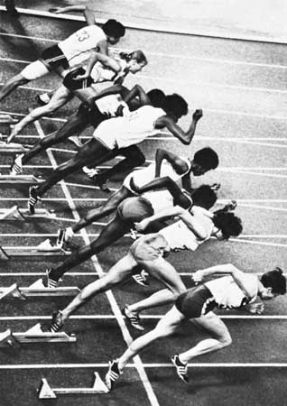

!SLIDE bullets incremental

  * Why?
  * For what?

!SLIDE bullets incremental

# Unit tests in long run gives us #

  * Faster time-to-market 
  * Scary of refactor?
  * Higher quality
  * Better design (for new code written with TDD)

!SLIDE center

# Start! #

